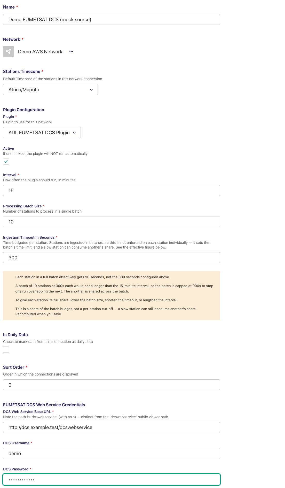
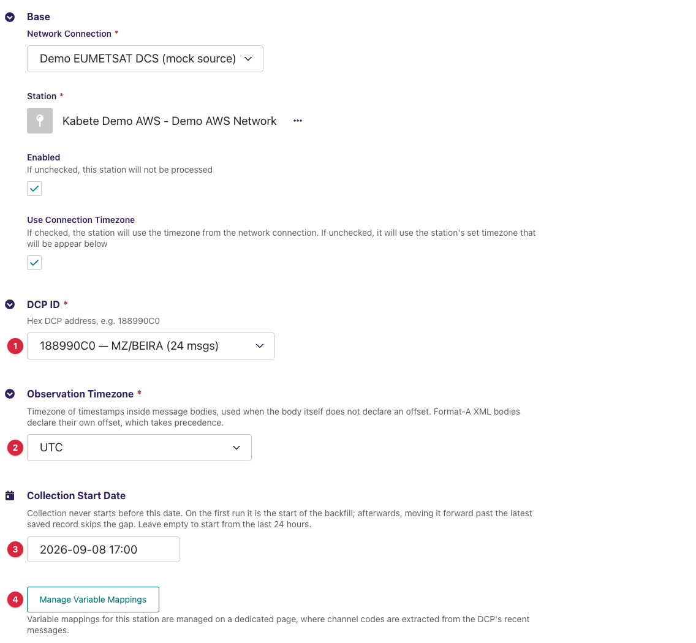
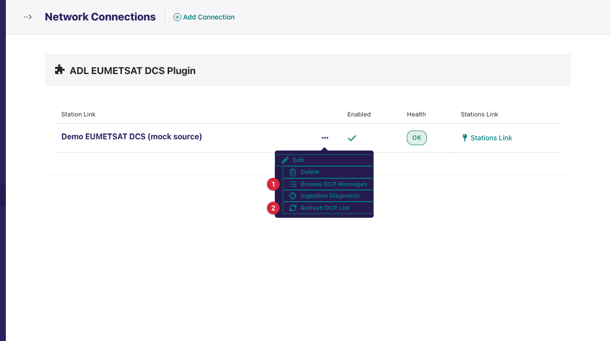
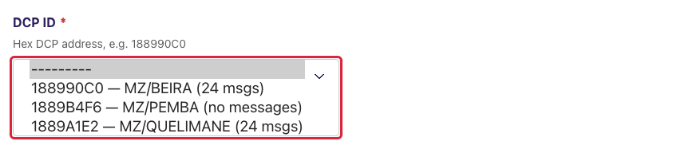
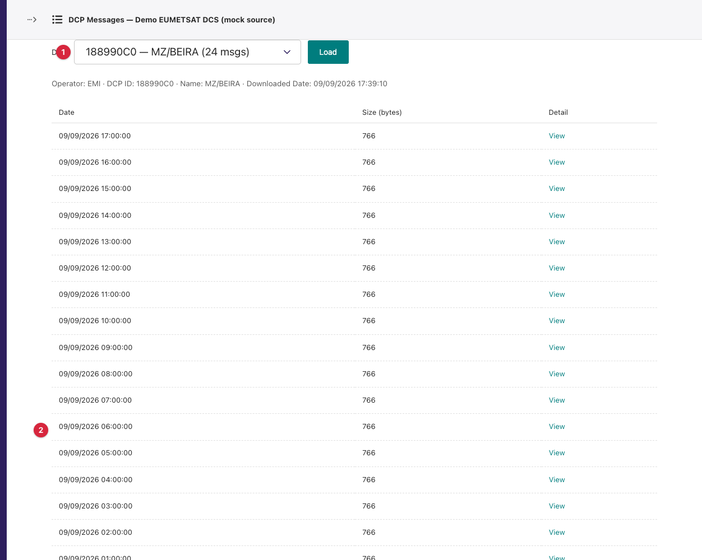
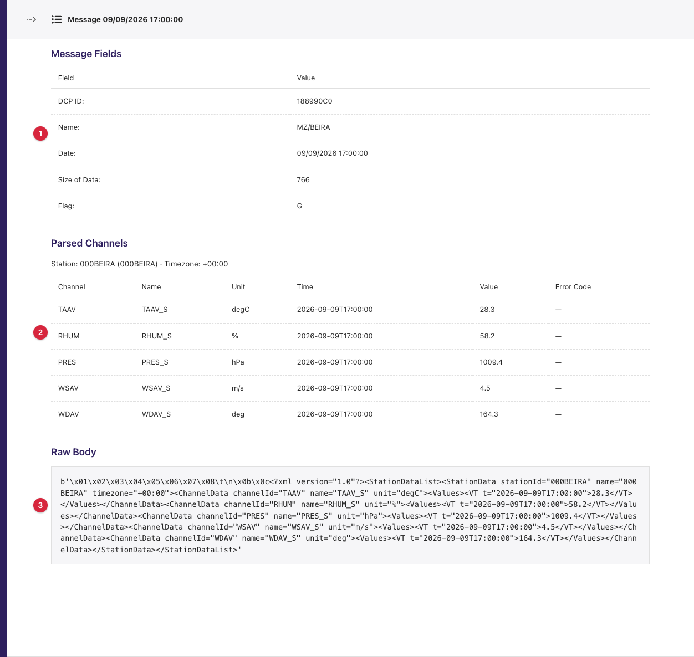
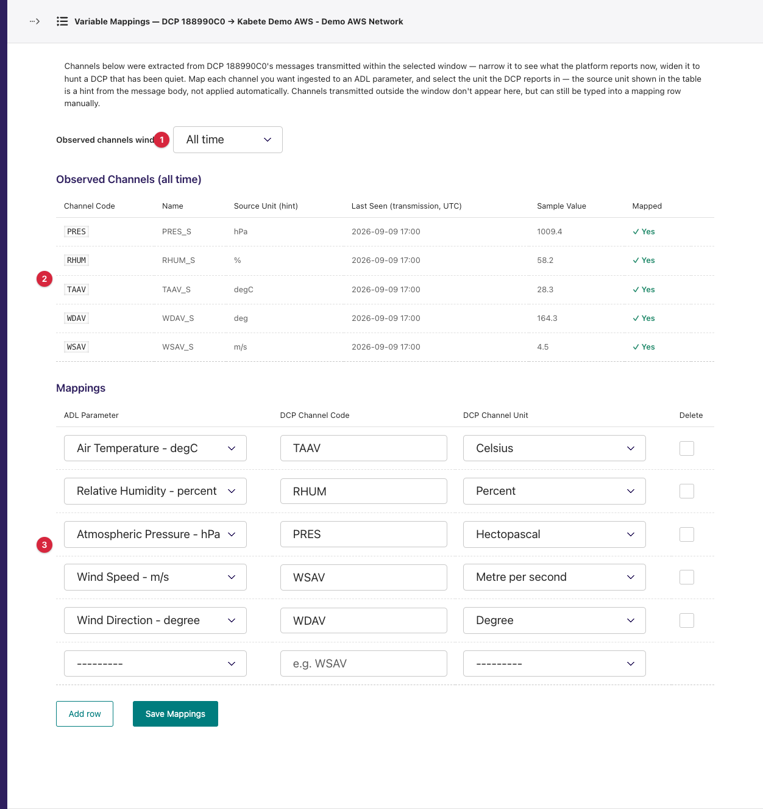
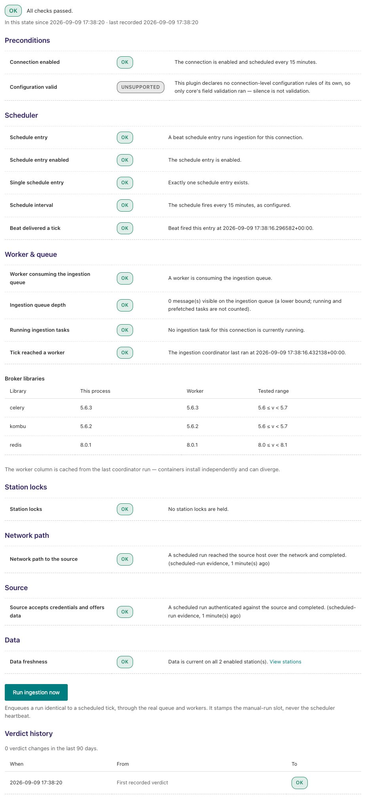

---
adl_plugin:
  name: ADL EUMETSAT DCS Plugin
  connects_to: EUMETSAT Meteosat Data Collection Service (DCS) Web Service
  category: general
  choose_when: Your stations are Data Collection Platforms transmitting through Meteosat, and you hold a DCS Web Service account.
---
# ADL EUMETSAT DCS Plugin

Collects the messages that **Data Collection Platforms (DCPs)** transmit
through Meteosat, by logging in to the **EUMETSAT Data Collection Service
(DCS) Web Service** with an operator account, downloading each platform's
message backlog and decoding the sensor readings inside the message bodies.
One connection holds one DCS account; one station link binds an ADL station
to one DCP address and maps that platform's channel codes to ADL parameters.

**Repository:** [adl-eumetsat-dcs-plugin](https://github.com/wmo-raf/adl-eumetsat-dcs-plugin)
**Plugin type identifier:** `adl_eumetsat_dcs_plugin`
**Connection model:** `EumetsatDCSConnection` · **Station link model:** `EumetsatDCSStationLink`

> **About the screenshots.** Every image in this guide is regenerated from
> `docs/screenshots.yml` against a seeded demo instance, so account names,
> DCP ids, station names and readings in them are placeholders — not values
> to copy. The field tables are the reference for what to enter.

## Overview

The DCS Web Service (`https://service.eumetsat.int/dcswebservice/`) is a
web application, not an API: its automatic download endpoint returns a
platform's **entire retained backlog** (roughly the last four weeks) as one
compressed file on every call, and its browse pages need a logged-in session.
This plugin works with that:

```
DCP ──(Meteosat)──▶ EUMETSAT DCS ──▶ ACTION_DOWNLOAD (full backlog, gzip) ──▶ ADL
                                            │  cached 5 minutes per DCP
                                            ▼
                     split into messages ──▶ parse body ──▶ filter by transmission time
                                            │
                                            ▼
                     one record per observation time, keyed by channel code ──▶ mappings
```

Every collection cycle downloads the backlog once per DCP (a five-minute
cache stops repeated pulls inside one cycle), keeps the messages transmitted
inside the run's window, and turns each message's channels into readings.
The core's upsert makes the overlap between cycles harmless.

Message bodies come in **three encodings** the plugin can read, and platforms
have been seen to switch between them across firmware updates:

| Body format | What it looks like | Observation time | Channel name / unit in body |
|---|---|---|---|
| **A** — verbose XML | `<StationData … timezone="+03:00"><ChannelData channelId="WSAV" …><VT t="2026-07-08T15:50:00">0.9</VT>` | Per channel, with the body's own UTC offset. | Yes |
| **B** — compact tags | `<STATION>…</STATION><SENSOR>TAAV</SENSOR><DATEFORMAT>YYYYMMDD</DATEFORMAT>…` then `20260805;120000;23.5` | Per channel, **no offset** — read in the station link's *Observation Timezone*. | No |
| **C** — colon-tag ASCII | `:WISI 25 #60 2.3 :WIDI 25 #60 223.8 …` | None in the body; the message's **transmission time** (UTC) is used. | No |

Any other encoding (a pseudo-binary body) is skipped with a log line. The
**channel code** — `WSAV`, `TAAV`, `WISI` … — is the key you map, and it
differs from platform to platform, which is why mappings live on the station
link and why the plugin ships a page that reads them off the platform's real
messages.

## Prerequisites

- A running ADL instance (see [ADL installation](https://adl-tool.readthedocs.io/en/latest/installation.html)).
- A **DCS Web Service operator account** (username and password) with the
  DCPs registered to it — obtained from EUMETSAT's User Service. Confirm the
  credentials work on `https://service.eumetsat.int/dcswebservice/` (with an
  *s*; the `dcpwebservice` public viewer is a different application and its
  logins do not work here).
- Outbound HTTPS from the ADL host to `service.eumetsat.int:443`.
- The **DCP address** of each platform — 8 hex characters such as
  `188990C0` — from the account's *DCP Administration* page (the plugin's
  pick-list reads it for you).
- The timezone the platform stamps its readings in, for Format-B bodies.

## Installation

Installed like any ADL plugin — see [Plugin Installation](https://adl-tool.readthedocs.io/en/latest/developer_guide/plugins/plugin_installation.html)
for all methods. The `plugins.toml` entry:

```toml
[[plugins]]
name = "ADL EUMETSAT DCS Plugin"
git  = "https://github.com/wmo-raf/adl-eumetsat-dcs-plugin.git"
tag  = "0.3.0"
```

After rebuild/restart, confirm it appears in `docker compose exec adl
list-plugins`, and that **EUMETSAT DCS Connection** is offered when adding a
connection.

## Connection configuration

In the ADL admin go to **Connections → Add**, choose **EUMETSAT DCS
Connection**, and fill in the base fields (name, network, plugin processing
enabled and interval, stations timezone …) as described in
[Manage Connections](https://adl-tool.readthedocs.io/en/latest/user_guide/manage_connections.html).
Plugin-specific fields, under *EUMETSAT DCS Web Service Credentials*:

| Field | Required | Default | Description |
|---|---|---|---|
| DCS Web Service Base URL | yes | `https://service.eumetsat.int/dcswebservice` | Leave the default. Note the path is `dcswebservice` (with an *s*). |
| DCS Username | yes | — | The operator account. |
| DCS Password | yes | — | Its password. Stored as entered; the form shows it in the clear. Sent as a query parameter on downloads and in a login form for the browse pages, over HTTPS. |



There are no connection-level variable mappings: channel codes vary per
platform, so mappings are per station link.

## Station link configuration

For each platform to collect, go to **Connections → the connection → Station
Links → Add** and create an **EUMETSAT DCS Station Link**. Base fields
(station, enabled, timezone override, aggregation …) are the core's;
plugin-specific fields:

| Field | Required | Default | Description |
|---|---|---|---|
| DCP ID | yes | — | The platform's hex address. A pick-list of the account's registered DCPs, each shown as `<id> — <name> (<n> msgs)` or `(no messages)`, loaded from the selected connection (see *Admin UI*). Whitespace is trimmed and the value upper-cased on save; anything but hex characters is refused with `DCP ID must contain only hexadecimal characters (0-9, A-F).` |
| Observation Timezone | yes | UTC | Timezone of the timestamps inside **Format-B** bodies, which carry none. Format-A bodies declare their own offset, which wins; Format-C bodies use the transmission time, which is UTC. |
| Collection Start Date | no | empty | Collection never starts before this date. On the first run it is the start of the backfill; afterwards, moving it forward past the latest saved record skips the gap. Leave empty to start from the last 24 hours. Must be in the past. |
| Variable mappings | yes | — | Not on this form: the **Manage Variable Mappings** button (shown once the link is saved) opens the dedicated page below. |



### Station variable mappings

Managed on the link's *Variable Mappings* page (next section). Each row:

| Field | Description |
|---|---|
| ADL Parameter | The ADL `DataParameter` the values are stored under. |
| DCP Channel/Sensor Code | The channel code exactly as it appears in the message bodies, e.g. `WSAV`, `TAAV`. **Case-sensitive**; whitespace is trimmed. |
| DCP Channel Unit | The unit the platform reports that channel in; ADL converts to the ADL parameter's unit. A Format-A body names a unit, which the page shows as a hint — it is not applied automatically. |

**Example:** ADL Parameter `Wind Speed` ← DCP Channel Code `WSAV`, unit `m/s`.

## Admin UI added by this plugin

The plugin adds a pick-list to the station link form, two buttons on the
connection row, one button on the station link row (and its edit form), and
three pages behind them.

### Entry points

On the **Network Connections** list, each EUMETSAT connection row carries two
extra actions:

- **Browse DCP Messages** — opens the message browser (new tab).
- **Refresh DCP List** — clears the cached list of registered DCPs (cached
  24 hours) and returns to the page you came from with `DCP list cache
  cleared — it will be refetched from the DCS Web Service on next use.`

On the **EUMETSAT DCS Station Links** list, each row carries **Variable
Mappings**, and the link's edit form shows **Manage Variable Mappings** under
its fields (on a new, unsaved link it says `Save this station link first,
then map its variables — channel codes will be extracted from the DCP's
recent messages.`).



### DCP ID pick-list on the station link form

1. Choose the **Network Connection**; the *DCP ID* select clears, shows a
   spinner and asks ADL for the account's registered DCPs
   (`adl-eumetsat-dcs-plugin/conn-dcps/`). ADL logs in to the DCS Web Service
   and reads its *DCP Administration* page — the first time takes a few
   seconds; afterwards the list comes from a 24-hour cache.
2. Pick the platform. Platforms that have never transmitted are listed too,
   marked `(no messages)`; they are valid targets.
3. If the service cannot be reached, the error is shown above the select and
   the list stays empty; the field still accepts a typed hex id.



### Step 1 — Browse DCP Messages

`adl-eumetsat-dcs-plugin/messages/<connection id>/`. A **DCP** selector at
the top lists the account's registered platforms (falling back to the DCP
ids of the connection's station links if the roster cannot be read). Press
**Load** to list, for that platform, what the service currently holds:

| Column | Meaning |
|---|---|
| Operator · DCP ID · Name · Downloaded Date (summary line) | The service's own metadata for the platform. |
| Date | Transmission date and time of each retained message (UTC). |
| Size (bytes) | Message length. |
| Detail | **View** opens the message. |

An unreachable service or a failed login renders its error in a red box on
the page instead of failing the admin.



### Step 2 — DCP Message detail

`adl-eumetsat-dcs-plugin/message-detail/<connection id>/?dcp_id=…&date=…`.
Three sections:

1. **Message Fields** — the service's header for the message: DCP ID, Date,
   Size of Data, subsystem, channel frequency, carrier level, platform length …
2. **Parsed Channels** — for a body the plugin can read: station id, name and
   timezone (Format A only), then one row per channel with *Channel*, *Name*,
   *Unit*, *Time*, *Value*, *Error Code*. This is where you confirm the
   channel codes and units before mapping. For an unreadable body the section
   says `This message body uses an encoding the parser does not handle yet
   (e.g. colon-tag or pseudo-binary) — see the raw body below.`
3. **Raw Body** — the exact bytes of the body, for a format the parser does
   not know.



### Step 3 — Variable Mappings page

`adl-eumetsat-dcs-plugin/variable-mappings/<station link id>/`, reached from
the *Variable Mappings* row action or *Manage Variable Mappings*. The page
downloads the platform's backlog and shows, above the mapping form, an
**Observed Channels** table of every channel code seen in messages
transmitted inside the selected window:

| Element | Meaning |
|---|---|
| Observed channels window | *Last 6 hours*, *Last 24 hours* (default), *Last 3 days*, *Last 7 days*, *All time*. Narrow it to see what the platform reports **now** — platforms change their whole channel vocabulary across firmware updates, so the all-time list buries the live codes under dead ones. Widening is free; the download is the same backlog. The choice survives a save. |
| Channel Code | The code to map. |
| Name / Source Unit (hint) | Known only from Format-A bodies; `—` otherwise. The unit is a hint, not applied. |
| Last Seen (transmission, UTC) / Sample Value | The newest message carrying the channel, and its value there. |
| Mapped | `✓ Yes` if a mapping row already names the code. |
| Add mapping | Fills the code into the empty mapping row below (or adds a row) and focuses its parameter select. |

Below it, the **Mappings** form: one row per mapping with *ADL Parameter*,
*DCP Channel Code* (a text field offering the observed codes as suggestions —
a code outside the window can still be typed), *DCP Channel Unit*, and a
*Delete* tick for saved rows. **Add row** adds a blank; **Save Mappings**
saves the whole set and confirms with `Variable mappings saved.`

If the service cannot be reached the table is replaced by `Could not fetch
messages from the DCS Web Service — observed channels are unavailable. You
can still add mappings by typing channel codes manually.` followed by the
error; the form still works.



## Data collection behavior

One collection cycle, per enabled station link:

1. ADL resolves the window: from the latest observation already stored (or
   *Collection Start Date* / 24 hours ago on the first run) to now.
2. The plugin downloads the platform's backlog — or reuses the copy cached in
   the last five minutes — and splits it into messages.
3. Messages are kept when their **transmission time** lies between one hour
   before the window start (readings lag their transmission) and the window
   end.
4. Each kept message's body is parsed. For every channel, the observation
   time is resolved (Format A: the body's offset; Format B: *Observation
   Timezone*; Format C: the transmission time), the value is converted to a
   number, and it is filed under that time. A channel with an error code, a
   non-numeric value or an unparseable time is skipped with a log line.
5. ADL applies the variable mappings and unit conversion and stores the
   values; observations already stored are updated, not duplicated.

- **First run:** the last 24 hours unless a start date is set. The full
  backlog is retained about 28 days, so a start date further back than that
  yields nothing older.
- **Backfill:** set *Collection Start Date* (within the service's retention)
  before enabling the link.
- **Timezones:** see the format table in *Overview*. All observation times
  are converted to UTC before storage.
- **Cache sharing:** the five-minute backlog cache is keyed by DCP id only,
  so two connections pointing at the same platform share it.

## Source checks / diagnostics

This plugin implements **no source check**. On the connection's **Ingestion
Diagnostic** page (Connections list → *Health* column) the *Network path* and
*Source* layers therefore report that the plugin does not support probing,
and **Probe source now** has nothing to run; the useful layers are the
scheduler and worker checks above and the **Data** layer below, which
reports whether recent runs stored anything. The station link's **Inspect**
page shows *Collection Status* but no *Station Source Check* panel. How to
read these screens is covered in
[Monitoring & Diagnostics](https://adl-tool.readthedocs.io/en/latest/user_guide/monitoring_and_diagnostics.html).

The plugin's own health surfaces are the **Browse DCP Messages** page (does
the account log in, does the platform have messages) and the **Variable
Mappings** page's observed-channels table (are the messages parseable, and
what do they contain).



### Feedback catalogue — messages this plugin produces

Client errors appear in a red box on the browse and mapping pages, above the
DCP pick-list, and in the task log when ingestion hits them. Per-message
skips go to the worker log (`docker compose logs adl_celery_worker_adl`).

| Message (example) | Where | Meaning | What to do |
|---|---|---|---|
| `Expected gzip data for DCP 188990C0, got an HTML response back (check credentials and DCP ID)` | task log / mapping page | The download endpoint answered with a web page — a wrong username or password, or a DCP not registered to this account. | Check the credentials on the DCS site; check the DCP id. |
| `DCS Web Service returned 503 for action=ACTION_DOWNLOAD` | task log / mapping page | The service is down or refusing. | Retry later; check EUMETSAT service status. |
| `No messages could be parsed from the response for DCP 188990C0 (0 bytes) -- header pattern may not match this data` | task log / mapping page | The download was empty or not in the expected layout — a platform with no retained messages, or a service change. | Check the platform on *Browse DCP Messages*; a platform with `(no messages)` yields this until it transmits. |
| `Message at offset 4096 declares a 1262-byte body that runs past the end of the download -- …` | task log | A truncated download. | Transient; retried next cycle. |
| `Login did not return a JSESSIONID cookie -- check credentials` / `Login appears to have failed (a password field is still present on the response page) -- check credentials` | browse page, DCP pick-list, mapping page | The session login for the browse pages failed. | Check the credentials; the download path may still work. |
| `Login POST failed (503)` / `ACTION_LIST returned 500 for DCP 188990C0` / `DCP_ADMIN returned 500` | browse page, pick-list | The service errored on a browse page. | Retry later. |
| `Could not find the registered-DCP table on the DCP_ADMIN page -- page structure may differ from what this client expects (or the session bounced to a login page)` | DCP pick-list, browse page | The *DCP Administration* page did not look as expected — usually an expired or refused session. | Press *Refresh DCP List* and retry; if it persists, the site changed and the plugin needs updating. |
| `Could not find the message list table for DCP 188990C0 -- page structure may differ from what this client expects` | browse page | Same, for the message list. | As above. |
| `Could not find message data for DCP 188990C0 at 05/08/2026 12:25:47 (status=200). Likely causes: no message exists for that exact date/time string …` | message detail page | The *View* link's date no longer matches a retained message, or the page layout changed. | Go back to the list and open a current message. |
| `No registered DCPs found and no station links with a DCP ID exist on this connection yet. Add one, or pass ?dcp_id= in the URL.` | browse page | Nothing to browse. | Add a station link, or check the account has DCPs. |
| `Both dcp_id and date query parameters are required.` | message detail page | The page was opened without a message reference. | Open it from the list. |
| `This DCP transmitted no parseable messages within the selected window (last 24 hours), so there are no observed channels to show. Try a wider window above, or add mappings by typing channel codes manually.` | mapping page | The platform was quiet, or its bodies are in an unreadable encoding. | Widen the window; open a message's detail to see its raw body. |
| `DCP 188990C0 seq 412: unparsed body encoding, skipped` | worker log (info) | A message body in an encoding the plugin cannot read (pseudo-binary). | Nothing to configure; the format needs a parser. |
| `DCP 188990C0 seq 412: channel TAAV has errorcode E1, skipped` | worker log (warning) | The platform flagged the reading as bad. | Normal; the value is not stored. |
| `DCP 188990C0 seq 412: channel TAAV has non-numeric value '--', skipped` | worker log (warning) | A truncated or textual value. | Normal for a cut-off message. |
| `DCP 188990C0 seq 412: unparseable channel time '20260805;120000', skipped` | worker log (warning) | A Format-B body with a date format other than `YYYYMMDD`. | Report the platform's format so the parser can be extended. |
| `DCP 188990C0 seq 412: channel WISI has no observation time, skipped` | worker log (warning) | A Format-C message whose header time could not be read. | Transient corruption. |
| `DCP 188990C0 seq 412: unparseable transmission time '35/13/26' '12:25:47', skipped` | worker log (warning) | A corrupt message header. | Nothing. |
| `DCP ID must contain only hexadecimal characters (0-9, A-F).` | station link form | Validation on save. | Enter the hex address. |
| `Network connection ID is required.` / `The selected connection is not a EUMETSAT DCS Connection.` | DCP pick-list | The form asked for the list before a connection was chosen. | Choose the connection first. |

## Troubleshooting

**Everything fails with "got an HTML response back"**
: The account cannot download. Log in on the DCS Web Service site by hand
  with the same credentials; make sure it is the `dcswebservice`
  application, not the public `dcpwebservice` viewer.

**The observed-channels table is empty although the browse page lists messages**
: The messages are in an encoding the plugin does not parse, or none were
  transmitted in the window. Widen the window to *All time*; open a message
  detail and look at *Parsed Channels* — if it reports an unhandled encoding,
  the platform's format needs adding to the plugin.

**Readings are stored a few hours off**
: Format-B bodies carry no offset and are read in *Observation Timezone*.
  Set it to the platform's timezone. Format-C readings carry the
  *transmission* time, which lags the actual observation by the platform's
  buffering interval — an inherent limit of that format.

**The same channel is mapped but nothing is stored**
: Codes are case-sensitive and matched verbatim. Copy the code from the
  observed-channels table with *Add mapping* rather than typing it.

**Collection is slow or the service complains about load**
: Every cache miss downloads the whole backlog (about 1 MB per platform) and
  the cache lasts five minutes. Do not set the connection's collection
  interval below five minutes, and avoid opening the mapping page for many
  platforms at once.

**A platform added to the account does not appear in the pick-list**
: The roster is cached for 24 hours. Press **Refresh DCP List** on the
  connection row.

## Compatibility

| Plugin version | Requires ADL core | Notes |
|---|---|---|
| 0.3.0 | 0.8.x | Current release. Adds ingestion of Format-C (colon-tag) bodies using the message transmission time. Installs `requests` and `beautifulsoup4`. |
| 0.2.x | 0.8.x | Formats A and B only; Format-C messages are skipped as unparsed. |

## Changelog

See [GitHub Releases](https://github.com/wmo-raf/adl-eumetsat-dcs-plugin/releases).
